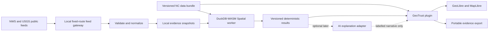

# GeoTrust architecture and feasibility

Status: proposed design, 2026-09-25. No implementation. The [source audit](GEOLIBRE-AUDIT.md) establishes the inspected upstream revision and distinguishes existing APIs from proposed GeoTrust components.

## Decision

Build **one external GeoLibre plugin with modular internals**, in a separate GeoTrust repository. Distribute it initially as a bundled drop-in alongside a pinned GeoLibre web build, served on localhost. This is a local distribution of GeoLibre plus a plugin, not a new GIS shell or permanent core fork.

| Option | Advantages | Costs and decision |
| --- | --- | --- |
| One plugin | Existing map, layers, inspection and project UI; one lifecycle and evidence model; one installation | Must own analysis runtime and carefully synchronize live layers. **Recommended.** |
| Several plugins | Independent add-ons and releases later | Feed/analysis/UI activation order, shared state, version skew and duplicated workers complicate an MVP. Keep modules separate in code, not independently installed. |
| Separate app embedding GeoLibre | Full control of outer workflow; verified iframe API | Two application states, origin policy and messaging; no generic host SQL bridge. Reconsider for a public portal or roles/workflows the plugin UI cannot support. |

If Phase 1 cannot demonstrate stable layer lifecycle using public APIs, stop and record the failing contract. Seek a narrowly scoped upstream API or revise the ADR before building the rest. Do not silently depend on internal stores. If the WASM budget fails, evaluate a local Python analysis service behind the same proposed contracts; this is a measured fallback, not an MVP prerequisite.

## What the MVP answers

| Question | Defensible MVP answer | Evidence limitation |
| --- | --- | --- |
| What is happening? | Current/replayed NWS alerts and USGS earthquake events, with source timestamps and update history | A warning is not an observed outage; an event list is not a damage assessment. |
| Who/what is exposed? | Hospitals, potential emergency shelter sites, major-road segments and NC communities intersecting alert coverage; assets near earthquake epicenters as a separate screening result | Proximity is not shaking intensity. Administrative warning areas can be much broader than actual impacts. |
| What could fail next? | Explicit conditional scenarios: if a selected exposed asset or road segment becomes unavailable, which verified dependencies may be affected? Otherwise list exposed assets needing review and state that dependencies are unknown | No failure probabilities, times-to-failure, inferred power grids or automatic causal claims. |
| How reliable is the evidence? | Source, age, geometry basis, completeness, revision, method, assumptions and contradictory observations | Publisher authority is distinct from data freshness, spatial precision and inference strength. |

NC means assets/communities inside the state boundary (FIPS 37), with border-crossing geometries retained before clipping. Default weather event allowlist: Tornado Warning/Watch, Severe Thunderstorm Warning/Watch, Flash Flood Warning/Watch, Flood Warning/Watch/Advisory, High Wind Warning/Watch and Wind Advisory. This is proposed product configuration, versioned and visible; unfamiliar events remain visible in the feed audit and are marked excluded from analysis. Hurricane/storm-surge layers and hydrological forecasts are later scope.

The local app monitors only while running. Sleep, closed tabs, offline periods and feed outages produce explicit coverage gaps. It is not an unattended emergency notification service.

## Component design

| Component | Responsibility and technology | Boundary |
| --- | --- | --- |
| GeoLibre host | Pinned web distribution, MapLibre only, simplified interface profile | No cloud login, default online basemap, collaboration or AI dependency. UI hiding is not security enforcement. |
| GeoTrust plugin | TypeScript, DOM panels, source adapters, stable layer IDs, scenario/evidence views | All names in this document other than audited GeoLibre methods are proposed GeoTrust interfaces. |
| Analysis worker | Own DuckDB-WASM Spatial instance; fixed, versioned SQL templates | Does not access GeoLibre's private SQL instance. Network inputs are registered bytes, not arbitrary SQL URLs. |
| Local launcher/gateway | Small Node process serving static assets and named NWS/USGS fetch routes | Needed for one-origin local operation, NWS identifying User-Agent, caching and bounded requests. No general URL proxy or analysis server. |
| Persistence | IndexedDB for snapshots/settings; explicit downloadable evidence bundle | Memory DB is disposable. Handle quota failure, export, eviction and schema migration. |
| Data preparation | Maintainer-only Python CLI with native DuckDB Spatial/Arrow as needed | Convert NC service extracts and Census Shapefiles to validated GeoParquet. End users use prepared bundles without Python. |

Use GeoJSON RFC 7946 for event exchange and small map results, GeoParquet 1.1 with WKB geometry and explicit CRS for full analytical assets, UTC RFC 3339 timestamps, JSON Schema for manifests, and SHA-256 content hashes. [GeoParquet specification](https://geoparquet.org/releases/v1.1.0/).

PMTiles is optional display packaging for a local basemap/large road visualization, not the analytical dataset: generalized tile fragments cannot provide exact counts or road lengths. Start with a blank local style and NC boundaries; add PMTiles only if display performance warrants it. Local hosting must support byte ranges. [PMTiles design](https://docs.protomaps.com/pmtiles/).

STAC is appropriate for later versioned imagery/ShakeMap raster assets; no STAC server or STAC conversion of every warning is required. Use a simple versioned bundle manifest now. PostGIS is deferred until multi-user editing, server-side concurrency or data volume justifies it. FastAPI is deferred unless a measured Python runtime need emerges. These preferences avoid deploying services just to include technologies in the stack. [STAC scope](https://stacspec.org/en/about/stac-spec/).

## Sources and reuse restrictions

Dataset terms are independent of the code license. Store the original terms URL, publisher, retrieval date and a terms snapshot with each released bundle. Do not turn a blank copyright field into a license claim.

| Source | Selected use | Rights and constraints |
| --- | --- | --- |
| [NOAA/NWS API](https://www.weather.gov/documentation/services-web-api) | `https://api.weather.gov/alerts/active?area=NC`, requesting GeoJSON; resolve null geometry via `affectedZones` | Public, no paid key; identifying User-Agent, rate limits and caching apply. Preserve message text/source links and separate GeoTrust interpretation. See [NWS disclaimer](https://www.weather.gov/disclaimer). |
| [USGS GeoJSON feeds](https://earthquake.usgs.gov/earthquakes/feed/v1.0/geojson.php) | `https://earthquake.usgs.gov/earthquakes/feed/v1.0/summary/all_week.geojson`; filter locally | Federal works generally public domain, but third-party products require inspection; credit USGS and retain uncertainty/revisions. [USGS rights](https://www.usgs.gov/information-policies-and-instructions/copyrights-and-credits). |
| [NC OneMap Hospitals](https://services.nconemap.gov/secure/rest/services/NC1Map_Health/FeatureServer/0) | Primary hospital inventory; preserve facility type | Source contains several hospital/specialty/emergency-facility categories, not equivalent service capacity. [Service terms pointer](https://services.nconemap.gov/secure/rest/services/NC1Map_Health/MapServer/info/iteminfo). |
| [NC OneMap Potential Emergency Shelters, layer 2](https://services.nconemap.gov/secure/rest/services/NC1Map_Emergency_Law_Enforcement/FeatureServer/2) | Primary potential shelter inventory | Candidate buildings only; no assertion they are designated, open, available or safe. Exclude contact/phone fields from public bundles. [Service terms pointer](https://services.nconemap.gov/secure/rest/services/NC1Map_Emergency_Law_Enforcement/FeatureServer/info/iteminfo). |
| [Census TIGER/Line](https://www.census.gov/geographies/mapping-files/time-series/geo/tiger-line-file.html) | Primary/secondary roads, counties and tracts | Public-domain geography; dated inventory, not live closures or a validated routing graph. Use verified 2025 NC road archive `tl_2025_37_prisecroads.zip` from the [2025 directory](https://www2.census.gov/geo/tiger/TIGER2025/PRISECROADS/), not an unpinned “latest.” [Census public-domain statement](https://www.census.gov/newsroom/archives/2014-pr/cb14-208.html). |

The [NC OneMap terms](https://www.nconemap.gov/pages/terms), read in the rendered page on 2026-09-25, explicitly state a free and unrestricted use policy, do not require written release agreements, disclaim accuracy/warranty and prescribe a website citation. Record this as `LicenseRef-NC-OneMap-Terms`, not an invented CC0/MIT label. Phase 1 must save layer-level metadata, confirm no narrower restrictions and establish actual source vintage; website/service modification time is not a survey date. Public-domain data counts as openly reusable alongside permissively licensed data.

Alternatives are deliberately not mandatory:

- OSM/Geofabrik is an openly licensed fallback for hospitals/roads, under ODbL with attribution and database share-alike considerations. Maintain OSM-derived databases separately and evaluate obligations for distributed derived databases; separation alone does not waive the license. Do not use public OSM tile servers for bulk offline downloads. [OSM copyright and service distinctions](https://www.openstreetmap.org/copyright), [NC extract](https://download.geofabrik.de/north-america/us/north-carolina.html).
- Do not equate OSM rain shelters, assembly points, homeless shelters and emergency evacuation shelters.
- FEMA's live shelter service is a possible later operational-status overlay, not the baseline inventory. Its [metadata](https://gis.fema.gov/arcgis/rest/services/NSS/FEMA_NSS/MapServer/info/iteminfo) credits FEMA/Mass Care/Red Cross but has empty license information. A separate [HIFLD catalog record](https://catalog.data.gov/dataset/national-shelter-system-facilities) links government-work terms and has a 2022 data date; that does not establish freshness or rights for every live service field. Resolve those differences before redistributing it.
- For communities, start with county and tract identifiers/names and intersected area. Add matched-vintage Census population tables in Phase 2 if needed. Do not infer residents exposed from polygon area alone or call total tract population the exposed population.

## Feed behavior and temporal meaning

**Weather:** proposed polling every 60 seconds while active, shared across tabs by the gateway; NWS recommends no more often than every 30 seconds. Respect cache headers, Retry-After and exponential backoff. Retain identifiers, references, status, messageType, sent, effective, onset, expires, ends, severity, certainty and urgency. Process updates/cancellations and deduplicate references; exclude test/exercise messages from live findings. A polygon may be null: union the versioned `affectedZones` polygons and label the result `zone-derived`; unresolved geometry stays in the event list with spatial exposure `unknown`. Never replace a failed fetch with “no hazards.” [NWS alert service](https://www.weather.gov/documentation/services-web-alerts).

**Earthquakes:** proposed polling every 60 seconds against the weekly summary, which USGS updates every minute. Key revisions by event ID plus `updated` and payload hash; retain null magnitude, review status and depth separately. USGS coordinate Z is depth in kilometers, not GeoJSON elevation in meters: remove Z from analysis geometry and retain `depth_km`. Default screen is epicentral distance within a user-visible 100 km radius of NC assets (configurable 10–300 km). It is an analyst screening threshold, not a damage model. Include events outside NC when their screen reaches NC. Fetching the global summary avoids state-boundary filtering errors; older replay/backfill can later use the [USGS catalog API](https://earthquake.usgs.gov/fdsnws/event/1/).

Store upstream event time, upstream update time, first/last observation, retrieval time and last successful feed check separately. Proposed live-feed health: stale after 5 minutes without success, unavailable after 30; display elapsed age continuously and label these as product thresholds. A healthy empty response is distinct from a failed response. Historical replay evaluates validity at its chosen timestamp and always displays a replay badge. A revision history exists only for observations GeoTrust captured; offline gaps cannot be reconstructed from the active-alert endpoint.

## Data model and reproducibility

These are proposed schemas, not GeoLibre APIs:

| Record | Required content |
| --- | --- |
| `DatasetVersion` | Provider/dataset ID, URL, rights/attribution, source vintage or unknown, retrieved time, CRS, schema version, content hash, bounding box, feature/invalid counts, acquisition completeness |
| `HazardRevision` | Provider/event ID, revision hash, event/update/retrieval times, validity interval, type, native severity fields, geometry or null, geometry basis, supersession/cancellation references |
| `Asset` | Provider-qualified ID, dataset version, type/subtype, geometry, positional quality, public name, operational status `unknown` unless independently observed |
| `Community` | GEOID, vintage, county/tract/name, boundary geometry; optional separately sourced population estimate and uncertainty |
| `AnalysisRun` | Input hashes, engine/extension version, algorithm/rules version, CRS/units, thresholds, as-of time, coverage flags, completion status |
| `Finding` | Stable ID, run ID, asset/community and hazard revision IDs, predicate, computed metric/units, evidence references, limitations; class `exposure`, `proximity` or `scenario` |
| `DependencyEdge` | From/to asset, dependency kind, evidence source/date, status verified/assumed, scenario-only flag |

Provider IDs may change across releases. Namespace source object IDs by dataset version unless the publisher documents stable IDs; retain crosswalks instead of claiming cross-release identity. Keep original source geometries and separately flagged repaired/projected versions. Bundle export contains manifest, allowed input snapshots, findings, rule parameters, hashes and attribution. GeoLibre project JSON is a view, not the evidence archive.

Analysis identity is derived from canonical parameters/input hashes; normalize ordering and numeric precision before hashing results. Creation time is metadata, not part of the analytical identity. Repeatability applies to pinned engines; cross-platform metric tolerances must be declared rather than promising byte-identical floating-point geometry on every runtime.

## Deterministic analysis

1. Validate schema, finite coordinates, geometry type, CRS, dates and bounds. Quarantine invalid/missing geometry with a reason; do not quietly discard it. Retain failed-record counts in denominators.
2. Materialize active hazard revisions at the selected time. Preserve original coverage before clipping to NC. Deduplicate multipart/overlapping records by source identity.
3. Use bounding-box pruning followed by exact spatial predicates. Point assets on the polygon boundary count as exposed. Polygon assets use actual footprints where available; NC point inventories remain explicitly location-based approximations.
4. For roads, intersect unsimplified lines with hazard polygons; report affected source segments and unioned affected length to avoid double-counting overlapping warnings. A tangent point has zero affected length but can carry a boundary-contact flag. County/tract exposure reports overlap geometry/area and hazard IDs, not an invented casualty estimate.
5. Normalize display geometry to longitude/latitude. Use a tested meter-based projected CRS, EPSG:32119 for NC length/area operations, with explicit axis order and transformations. Use a validated geodesic distance routine for epicentral screening. Never buffer longitude/latitude degrees as meters or use Web Mercator area as ground truth. Validate DuckDB Spatial availability and semantics against independent fixtures before adopting function calls.
6. Publish results atomically against one complete set of input versions. A newer feed update cancels/invalidates old worker work; a late result cannot overwrite a newer run. Abort incomplete runs rather than present truncated results as complete.
7. Rank review work through documented categorical rules (warning class, direct/zone-derived coverage, asset type, freshness), with deterministic tie-breaks. Keep evidence quality separate; an uncertain severe event must not disappear because its evidence is weak.

**Failure scenarios:** Phase 1 shows this question as unavailable because dependencies are not yet established. Phase 2 supports selected-asset unavailability and traversal of explicit, dated dependency edges, with cycle detection and displayed propagation paths. Assumed edges remain visibly scenario assumptions. Proximity to a major road is insufficient evidence of an access dependency. Major-road-only data cannot establish hospital reachability: local access streets, turns, bridges, speeds and closures are missing. No production routing, cascading utility failure or predicted recovery time is in the MVP.

**Reliability:** every finding presents a vector of provenance, freshness, geometry precision, coverage completeness, agreement/conflict and method strength. Values are categorical with machine-readable reason codes. Missing timestamps/geometry/dependencies mean unknown. Do not collapse these into an unsupported “87% confidence.” Evidence chains link finding → run → hazard revision and asset version → source bytes/metadata. A checksum proves integrity of captured bytes, not truth or publisher authenticity.

## Optional AI boundary

The deterministic system fully answers supported queries with structured tables and template sentences. Optional Phase 3 explanations consume only completed, cited findings through a separate adapter. An LLM cannot supply geometry, change severity, generate executable SQL, create dependency edges or modify results. Every generated claim needs finding IDs; unsupported claims are withheld. Label AI output, store model/prompt/version, and provide the underlying deterministic answer. A local model may be added; external providers are opt-in per data-sharing policy. Model failure or absence never blocks monitoring or analysis.

## Local operation, security and licensing

Ship a complete, checksummed local distribution and NC starter bundle. Node serves on loopback only. Offline/replay mode is the default; explicit live mode permits public hazard requests. Network is needed to obtain new observations, not to view or re-run existing ones. Runtime assets must work in a clean browser profile without prior CDN cache. End-user installation needs Node only; downloading/building releases can require network beforehand.

Constrain browser connections to the local origin with a tested content-security policy; the gateway is the only live-feed network path. Preserve the blob/worker/WASM permissions the inspected loader actually requires. Removing the coarse `plugins:install` host capability also gates plugin activation and menus, so it cannot be assumed to disable installation independently. Phase 1 must test the distribution profile and identify any small upstream change needed to retain the GeoTrust workbench while removing installer affordances. These controls reduce accidental egress and untrusted content execution; they do not protect the local owner from deliberately running code through devtools.

Use MIT for proposed GeoTrust code, retain GeoLibre's MIT notices, and generate an SBOM/license inventory from exact locks and copied binaries. MapLibre/DuckDB and their dependencies need their own notices; do not infer the entire distribution's license from its top-level license. If PostGIS is introduced, review its GPL obligations in the packaging model. Data licenses, basemap styles, fonts, icons and model weights get separate inventories.

The inspected upstream [MapLibre license](https://raw.githubusercontent.com/maplibre/maplibre-gl-js/main/LICENSE.txt) is BSD-3-Clause with additional included-code notices; [DuckDB-WASM](https://raw.githubusercontent.com/duckdb/duckdb-wasm/main/LICENSE) is MIT. These support redistribution with the applicable notices, but the release gate still inspects the exact locked versions and spatial-extension dependencies.

| Risk | Required control |
| --- | --- |
| Trusted plugin code can read host state/credentials | Bundle only reviewed, pinned plugins; no runtime remote plugin installation in the GeoTrust distribution. Hash release artifacts; avoid credentials entirely in the MVP. |
| Unexpected outbound data | Disable cloud sharing, collaboration, telemetry, AI and remote basemaps in the distribution; audit observed requests. Host UI profiles alone do not enforce this. |
| Feed text/metadata injection | Render text with safe DOM APIs; validate links, never execute HTML/SQL from feeds; neutralize CSV spreadsheet formulas in exports. |
| Local gateway SSRF/DNS rebinding | Exact named routes and upstream hosts, safe redirect policy, bounds/timeouts, response-size caps, Host/Origin checks and loopback bind. No arbitrary URLs, shell or filesystem paths. |
| Malicious archives/geometries | File/decompressed-byte/feature/vertex caps, path traversal protection, schema checks, worker memory/time budget and cancellation. |
| Sensitive asset and people data | Keep public locations and minimum fields only; no patients, residents, private addresses, shelter occupants or private contacts. Export preview and field allowlist. |
| Local privacy assumptions | IndexedDB is not encrypted storage; shared OS/browser profiles can access local work. Use clear-data controls and no unsolicited uploads. |
| Cache staleness or eviction | As-of labels, last-good snapshot with warning, quota handling, portable exports, atomic version changes. |
| Misleading operational decisions | Never mark an asset failed/open/safe from geometry alone; preserve official message and limitations beside interpretation. |

## Feasibility verdict

**Go for a bounded local exposure/evidence MVP.** Public plugin APIs, local browser analysis and openly reusable NC asset sources support it. **Do not promise predictive resilience modeling from the initial inputs.** Highest engineering risks are live-layer synchronization, cold offline WASM packaging and browser resource limits. Highest domain risks are unknown inventory currency, potential versus operational shelters, warning geometry and missing dependency data. Phase 1 resolves engineering feasibility and source quality before Phase 2 adds scenario interpretation.
